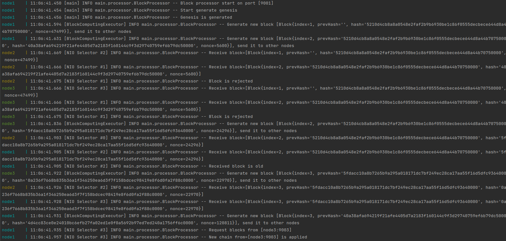

## Simple blockchain implementation
Ветка `master`:
[](https://github.com/VladislavFetisov/blockChainSimple/actions/workflows/tests.yml)

Ветка `develop`:
[](https://github.com/VladislavFetisov/blockChainSimple/actions/workflows/tests.yml)

## Запуск c помощью Docker
1. Склонировать репозиторий
```
git clone https://github.com/VladislavFetisov/blockChainSimple
```
2. Сбилдить Image 
```
docker build -t fetisov_block_chain:latest .
```
3. Запустить docker-compose
```
docker-compose up
```
## Пример работы кластера: 

  